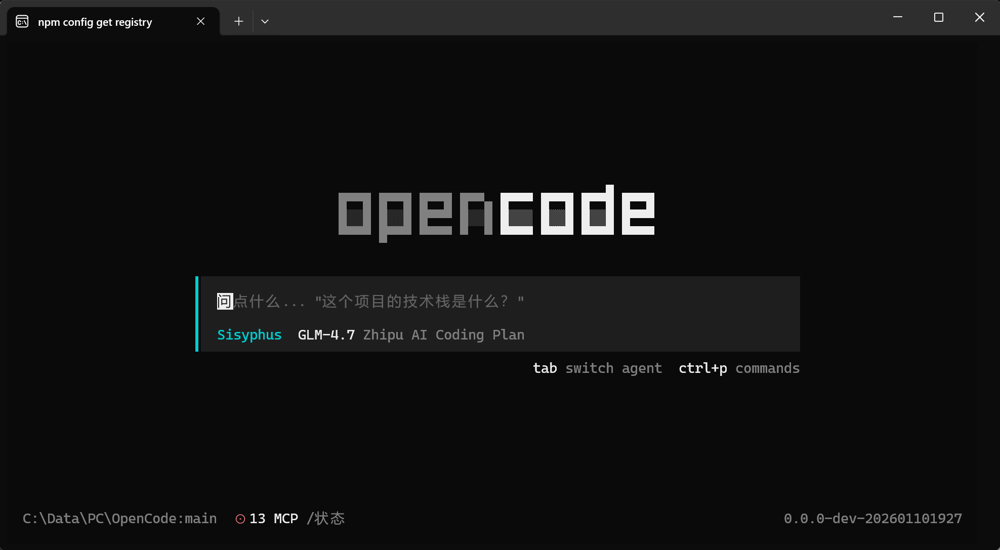
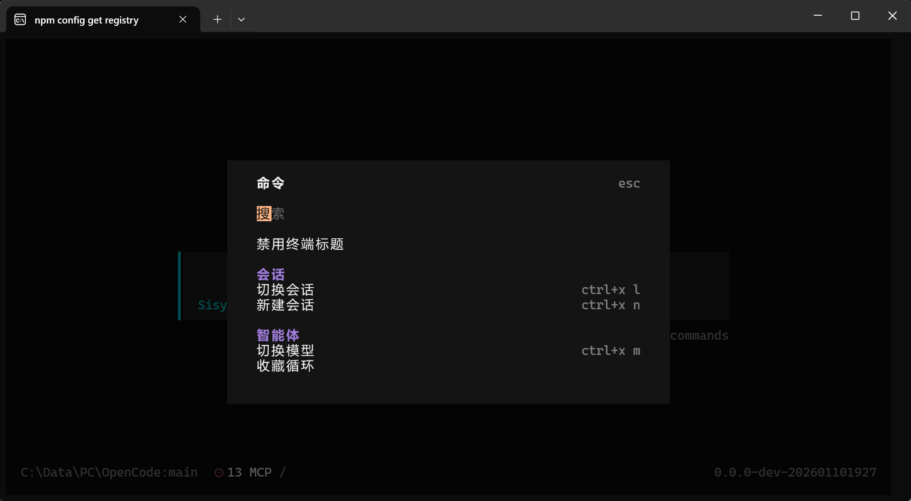

# OpenCode 中文汉化版

[](LICENSE)
[](https://microsoft.com/PowerShell)
[](https://gitee.com/QtCodeCreators/OpenCodeChineseTranslation)

[中文](#中文文档) | [English](#english-documentation)

---

## 中文文档

### 项目简介

> **OpenCode** 是由 [Anomaly Company](https://anomaly.company/) 开发的**开源 AI 编程代理**，提供终端界面 (TUI)、桌面应用和 IDE 扩展等多种使用方式。

**OpenCode 中文汉化版**是对 OpenCode 项目的本地化改造，通过模块化汉化配置和自动化脚本实现完整中文化，降低国内用户使用门槛。

<!-- 截图展示 -->
<p align="center">
  
  
  
</p>

**核心功能：**
- 🤖 AI 辅助编程 - 解释代码、添加功能、重构修改
- 📋 Plan 模式 - 先规划后实施，支持图片参考和迭代讨论
- ↩️ 撤销/重做 - `/undo` 和 `/redo` 命令轻松回退
- 🔗 对话分享 - 生成链接与团队协作
- 🔌 多模型支持 - 兼容各类 LLM 提供商

**本项目解决的问题：**

| 问题 | 解决方案 |
|------|----------|
| 全英文界面降低使用效率 | 完整汉化所有用户可见文本 |
| 每次更新需重新手动修改 | 自动化脚本支持一键更新和汉化 |
| 不熟悉命令行操作 | 提供交互式菜单，简化操作流程 |
| 开发环境配置复杂 | Codes 工具一键管理所有依赖 |

---

### 🚀 快速开始

#### 方式一：使用预编译版本（推荐，无需编译）

[下载预编译版本](https://github.com/1186258278/OpenCodeChineseTranslation/releases) | [查看编译环境](RELEASE.md)

```powershell
# Windows - 下载后直接运行
opencode.exe

# Linux/macOS - 下载后添加执行权限
chmod +x opencode
./opencode
```

**预编译版本说明**：
- 编译环境：Windows 11 + Bun 1.3.5
- 支持：Windows x64, Linux x64, macOS arm64/x64
- 限制：仅包含二进制文件，配置需自行设置

#### 方式二：完整安装（包含所有功能）

##### 步骤 1：安装 Codes 管理工具

**Codes** 是本项目的开发环境管理工具，安装后获得全局命令：

```bash
# Linux/macOS (推荐使用 Gitee 镜像)
curl -fsSL https://gitee.com/QtCodeCreators/OpenCodeChineseTranslation/raw/main/scripts/install.sh | bash
```

```powershell
# Windows PowerShell
irm https://gitee.com/QtCodeCreators/OpenCodeChineseTranslation/raw/main/scripts/install.ps1 | iex
```

安装完成后重启终端，即可使用 `codes` 命令。

#### 步骤 2：环境诊断

```bash
codes doctor
```

#### 步骤 3：安装缺失组件

```bash
codes install
```

---

### 🛠️ Codes 命令参考

**Codes** 是开发环境智能管理工具，提供一键安装、版本管理、环境诊断等功能。

#### 基础命令

| 命令 | 说明 |
|------|------|
| `codes` | 交互菜单 - 显示图形菜单 |
| `codes doctor` | 环境诊断 - 检查所有工具状态 |
| `codes install` | 安装组件 - 安装缺失的工具 |
| `codes install [编号]` | 按编号安装 - 只安装指定组件 |
| `codes upgrade` | 升级组件 - 升级已安装的工具 |
| `codes node lts` | Node 管理 - 切换到 LTS |
| `codes node 22` | Node 管理 - 切换到 v22 |
| `codes opencode` | 安装 OpenCode 汉化脚本 |
| `codes i18n` | 安装汉化管理工具 |
| `codes helper` | 启动智谱编码助手 |
| `codes env` | 显示环境变量 |
| `codes env-permanent` | 永久配置环境变量 |
| `codes update` | 检查并更新 Codes |
| `codes check-update` | 检查 Codes 新版本 |
| `codes --version` | 显示版本信息 |
| `codes --help` | 显示帮助信息 |

#### 支持的组件

| 编号 | 组件 | 说明 |
|------|------|------|
| 1 | Node.js | JavaScript 运行时 |
| 2 | Bun | 快速 JavaScript 运行时 |
| 3 | Git | 版本控制工具 |
| 4 | Python | 编程语言 |
| 5 | nvm | Node 版本管理器 |
| 6 | coding-helper | 智谱编码助手 |

#### 菜单选项

```
╔═══════════════════════════════════════════════╗
║           Codes - 开发环境管理工具               ║
╠═══════════════════════════════════════════════╣
║  [1] 环境诊断       - 检查所有工具状态           ║
║  [2] 安装组件       - 安装缺失的工具             ║
║  [3] 升级组件       - 升级已安装的工具             ║
║  [4] Node 管理     - 切换 Node.js 版本          ║
║  [5] Claude Code   - 安装 Claude Code          ║
║  [6] OpenCode      - 安装 OpenCode 汉化版       ║
║  [7] 汉化管理工具   - 安装汉化脚本                ║
║  [8] 智谱助手      - 启动 coding-helper        ║
║  [9] 环境变量       - 显示/导出环境变量            ║
║  [p] 永久配置      - 一键写入环境变量             ║
║  [u] 检查更新      - 检查 Codes 新版本          ║
║  [U] 更新 Codes    - 自动更新到最新版            ║
║  [0] 退出                                        ║
╚═══════════════════════════════════════════════╝
```

---

### 📦 OpenCode 安装部署

> **重要**：本项目使用**相对路径**设计，可放置在任意目录运行。
> **平台支持**：Windows (PowerShell) | Linux/macOS (Node.js)

#### 方式一：使用 Codes 安装（推荐）

Codes 会自动检测您的操作系统并安装对应版本的汉化脚本。

```bash
# 1. 安装 Codes (如果还没安装)
curl -fsSL https://gitee.com/QtCodeCreators/OpenCodeChineseTranslation/raw/main/scripts/install.sh | bash

# 2. 克隆本仓库
git clone https://gitee.com/QtCodeCreators/OpenCodeChineseTranslation.git
cd OpenCodeChineseTranslation

# 3. 使用 Codes 一键初始化（自动检测平台）
codes i18n
```

#### 方式二：手动安装

**Linux/macOS：**
```bash
# 克隆本仓库
git clone https://gitee.com/QtCodeCreators/OpenCodeChineseTranslation.git
cd OpenCodeChineseTranslation

# 安装依赖并运行
cd scripts/opencode-linux
npm install
./opencode.js full    # 一键全流程
```

**Windows：**
```powershell
# 克隆本仓库
git clone https://gitee.com/QtCodeCreators/OpenCodeChineseTranslation.git
cd OpenCodeChineseTranslation

# 首次运行会自动初始化
.\scripts\opencode\opencode.ps1
```

---

### 🎯 OpenCode 使用方法

#### Linux/macOS 版本

```bash
cd scripts/opencode-linux

# 交互式菜单
./opencode.js

# 命令行模式
./opencode.js update    # 拉取最新源码
./opencode.js apply     # 应用汉化
./opencode.js build     # 编译构建
./opencode.js verify    # 验证汉化覆盖率
./opencode.js full      # 一键全流程
```

#### Windows 版本

```powershell
.\scripts\opencode\opencode.ps1

# 选择 [1] 一键汉化+部署
```

#### 主菜单 (Windows)

| 选项 | 功能 | 适用场景 |
|------|------|----------|
| [1] | 一键汉化+部署 | 首次使用或需要完整更新 |
| [2] | 应用汉化 | 仅应用翻译，不编译 |
| [3] | 验证汉化 | 检查翻译覆盖率 |
| [4] | 调试工具 | 排查汉化问题 |
| [5] | 版本检测 | 检查并更新官方版本 |
| [6] | 备份版本 | 备份当前汉化版本 |
| [7] | 高级菜单 | 更多高级选项 |
| [R] | 恢复纯净 | 撤销汉化，恢复到出厂状态 |

---

### 📂 项目结构

```
OpenCodeChineseTranslation/
├── scripts/                 # 管理脚本目录
│   ├── install.sh           # Codes 一键安装脚本
│   ├── codes/               # Codes 核心脚本
│   │   ├── codes.sh         # Linux/macOS 版本
│   │   └── README.md        # Codes 详细文档
│   ├── opencode/            # OpenCode 汉化脚本 (Windows)
│   │   ├── opencode.ps1     # PowerShell 主脚本
│   │   └── init.ps1         # 自动初始化脚本
│   └── opencode-linux/      # OpenCode 汉化脚本 (Linux/macOS)
│       ├── opencode.js      # Node.js 主脚本
│       ├── package.json     # 依赖配置
│       ├── README.md        # 使用文档
│       └── lib/             # 核心模块
│           ├── env.js       # 环境检查
│           ├── git.js       # Git 操作
│           ├── i18n.js      # 汉化应用
│           ├── build.js     # 编译构建
│           ├── verify.js    # 验证功能
│           └── version.js   # 版本检测
├── opencode-i18n/           # 汉化配置目录 (两版本共享)
│   ├── config.json          # 主配置文件
│   ├── dialogs/             # 对话框汉化
│   ├── routes/              # 路由汉化
│   ├── components/          # 组件汉化
│   └── common/              # 通用汉化
├── opencode-zh-CN/          # OpenCode 源码 (自动克隆)
└── docs/                    # 项目文档
```

---

### 🔧 常见问题

| 问题 | 解决方法 |
|------|----------|
| 执行策略错误 | `Set-ExecutionPolicy -Scope Process -ExecutionPolicy Bypass` |
| 编译失败 | 确保已安装 Bun：`codes install` |
| 汉化未生效 | 运行 `[2] 应用汉化` 重新应用 |
| 网络超时 | 脚本会自动使用 Gitee 镜像 |
| 源码目录为空 | 运行 `.\scripts\init.ps1` 自动克隆 |
| 环境变量丢失 | 运行 `codes env-permanent` 永久配置 |

---

### 📊 汉化范围

| 模块 | 覆盖内容 |
|------|----------|
| 命令面板 | 会话管理、模型选择、智能体切换 |
| 对话框 | 智能体选择器、会话列表、消息处理 |
| 侧边栏 | 上下文管理、MCP 状态显示 |
| 顶部栏 | 子智能体导航 |
| 权限系统 | 文件操作权限请求 |
| 通知提示 | 70+ 条操作提示信息 |

---

### 🤝 贡献指南

欢迎贡献代码和翻译！

1. **修复翻译错误**：提交 PR 修改 `opencode-i18n/` 下的 JSON 文件
2. **新增汉化模块**：在对应目录添加新的 JSON 文件并更新 `config.json`
3. **脚本优化**：提交 PR 修改 `scripts/opencode/opencode.ps1`
4. **Codes 优化**：提交 PR 修改 `scripts/codes/codes.sh`

---

### 📄 许可证

本项目采用 MIT 许可证。详见 [LICENSE](LICENSE) 文件。

OpenCode 原项目采用 MIT 许可证，版权归 [Anomaly Company](https://anomaly.company/) 所有。

---

### 🔗 相关链接

| 链接 | 说明 |
|------|------|
| [Gitee 仓库](https://gitee.com/QtCodeCreators/OpenCodeChineseTranslation) | 国内镜像 |
| [GitHub 仓库](https://github.com/1186258278/OpenCodeChineseTranslation) | GitHub 主页 |
| [OpenCode 官方](https://github.com/anomalyco/opencode) | 原项目 |
| [问题反馈](https://github.com/1186258278/OpenCodeChineseTranslation/issues) | 提交 Issue |

---

## English Documentation

### Project Overview

> **OpenCode** is an **open-source AI coding agent** developed by [Anomaly Company](https://anomaly.company/), providing TUI, desktop app, and IDE extensions.

**OpenCode Chinese Translation** is a localized version with complete Chinese translation through modular configuration and automated scripts.

**Key Features:**
- 🤖 AI-assisted coding - Explain, add features, refactor
- 📋 Plan mode - Plan first, execute later
- ↩️ Undo/Redo - Easy rollback with `/undo` and `/redo`
- 🔗 Share conversations - Generate links for collaboration
- 🔌 Multi-model support - Compatible with various LLM providers

---

### Quick Start

#### Step 1: Install Codes

**Codes** is the development environment manager for this project:

```bash
# Linux/macOS (Gitee mirror recommended)
curl -fsSL https://gitee.com/QtCodeCreators/OpenCodeChineseTranslation/raw/main/scripts/install.sh | bash
```

```powershell
# Windows PowerShell
irm https://gitee.com/QtCodeCreators/OpenCodeChineseTranslation/raw/main/scripts/install.ps1 | iex
```

Restart your terminal after installation.

#### Step 2: Environment Check

```bash
codes doctor
```

#### Step 3: Install Missing Components

```bash
codes install
```

---

### Codes Commands

| Command | Description |
|---------|-------------|
| `codes` | Interactive menu |
| `codes doctor` | Environment check |
| `codes install` | Install components |
| `codes upgrade` | Upgrade components |
| `codes node lts` | Switch to Node.js LTS |
| `codes opencode` | Install OpenCode script |
| `codes env-permanent` | Permanently configure env vars |
| `codes update` | Update Codes to latest |
| `codes --help` | Show help |

---

### OpenCode Installation

```bash
# Clone repository
git clone https://gitee.com/QtCodeCreators/OpenCodeChineseTranslation.git
cd OpenCodeChineseTranslation

# Run the script
./scripts/opencode/opencode.ps1  # Windows
```

---

### License

This project is licensed under MIT. See [LICENSE](LICENSE) for details.

OpenCode original project is also MIT licensed, copyright by [Anomaly Company](https://anomaly.company/).

---

### Links

| Link | Description |
|------|-------------|
| [Gitee Repository](https://gitee.com/QtCodeCreators/OpenCodeChineseTranslation) | China mirror |
| [GitHub Repository](https://github.com/1186258278/OpenCodeChineseTranslation) | GitHub home |
| [OpenCode Official](https://github.com/anomalyco/opencode) | Original project |
| [Issue Tracker](https://github.com/1186258278/OpenCodeChineseTranslation/issues) | Report issues |
