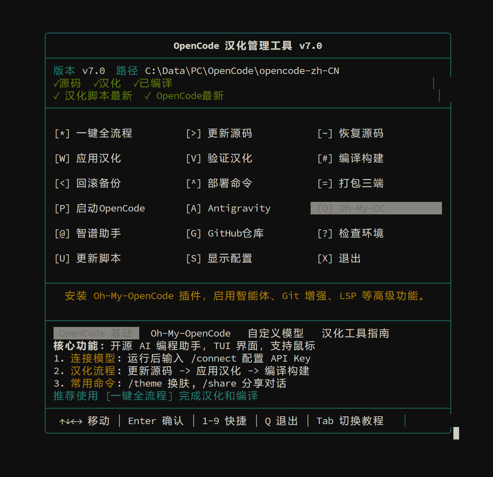

# OpenCode 中文汉化项目

[](LICENSE)
[](scripts/package.json)
[](#)

[中文](#中文文档) | [English](#english-documentation)

---

## 项目简介

**OpenCode 中文汉化版** 是针对开源 AI 编程代理工具 [OpenCode](https://github.com/anomalyco/opencode) 的本地化与增强发行版。本项目旨在降低国内开发者的使用门槛，提供完整的汉化支持、自动化构建流程以及针对国内网络环境的优化。

通过内置的 `opencodenpm` 管理工具，您可以轻松实现源码更新、汉化补丁应用、编译构建以及多平台发布。

### 核心特性

*   **完整汉化支持**：覆盖 TUI 界面、对话框、提示信息及核心交互流程。
*   **自动化工作流**：提供一键更新、汉化、验证、编译的全自动脚本。
*   **多平台兼容性**：完美支持 Windows、macOS 和 Linux 系统。
*   **增强插件集成**：内置 Oh-My-OpenCode 和 Antigravity 配置向导，解锁多智能体协作与本地模型支持。
*   **专业管理工具**：提供 TUI 交互式菜单，操作直观高效。

## 界面预览

<p align="center">
  
</p>

<p align="center">
  
  
</p>

---

## 快速开始

### 1. 环境准备

在开始之前，请确保您的开发环境满足以下要求：

*   **Node.js**: >= 18.0.0
*   **Bun**: >= 1.3.0 (用于快速编译)
*   **Git**: 最新版本

### 2. 安装管理工具

推荐全局安装 `opencodenpm` 管理工具，以便在任意位置管理项目。

```bash
# 进入脚本目录
cd scripts

# 安装依赖并链接全局命令
npm install
npm link
```

### 3. 运行交互式菜单

安装完成后，在终端直接输入以下命令启动管理界面：

```bash
opencodenpm
```

您将看到一个网格化的交互菜单，支持使用方向键或数字键选择功能。

---

## 功能指南

`opencodenpm` 工具集成了项目维护所需的所有功能。以下是常用命令说明：

### 基础操作

*   **一键全流程 (`full`)**: 自动执行源码更新、环境清理、汉化应用、配置验证及编译构建。推荐初次安装或版本升级时使用。
*   **更新源码 (`update`)**: 从官方仓库拉取最新代码。支持检测本地修改并提示处理。
*   **应用汉化 (`apply`)**: 将 `opencode-i18n` 目录下的翻译配置注入到源码中。包含变量保护机制，防止误翻译代码变量。
*   **编译构建 (`build`)**: 使用 Bun 编译生成可执行文件。构建产物将自动部署到 `bin` 目录。

### 高级功能

*   **部署命令 (`deploy`)**: 将 `opencode` 和 `opencodenpm` 命令注册到系统 PATH 环境变量中，使其可在任意终端直接调用。
*   **Oh-My-OpenCode (`ohmyopencode`)**: 安装增强插件，启用 Sisyphus、Oracle 等高级智能体角色，并支持界面美化（字体、背景图）。
*   **Antigravity (`antigravity`)**: 配置本地 AI 网关，支持接入 Claude 3.5、GPT-4o、DeepSeek 等模型。
*   **打包发布 (`package`)**: 为 Windows、macOS 和 Linux 生成发布版 ZIP 包，自动生成校验码和更新日志。

### 维护与排查

*   **恢复源码 (`restore`)**: 清除源码目录下的所有未提交修改，恢复到纯净状态。
*   **回滚备份 (`rollback`)**: 如果汉化后出现问题，可一键回滚到上一次的状态。
*   **环境检查 (`env`)**: 检测本地开发环境是否满足编译要求。

---

## 常见问题

**Q: 编译失败，提示缺少 bun 命令？**
A: 本项目依赖 Bun 进行快速构建。请访问 [bun.sh](https://bun.sh) 安装，或使用 `npm install -g bun`。

**Q: 汉化后部分界面仍显示英文？**
A: OpenCode 更新较快，部分新功能可能尚未收录到汉化配置中。您可以提交 Issue 反馈缺失的翻译。

**Q: 如何使用自定义模型？**
A: 推荐使用 `opencodenpm antigravity` 命令一键配置，或手动修改 `~/.config/opencode/opencode.json` 文件中的 `provider` 配置。

---

## 许可证

本项目基于 [MIT License](LICENSE) 开源。
OpenCode 原项目版权归 [Anomaly Company](https://anomaly.company/) 所有。
